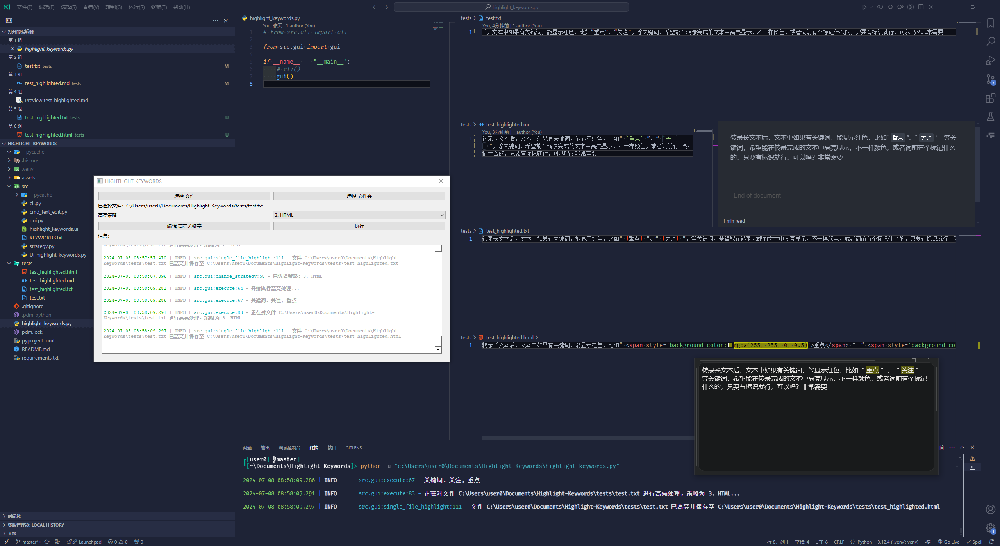

#  Highlight-Keywords



高亮文件中的关键字，并生成高亮后的文件。

## 用法

从 [Releases](https://github.com/H1DDENADM1N/Highlight-Keywords/releases) 页面下载最新版本的压缩包，解压后运行 `highlight_keywords.exe` 即可。

#### 或者：

```powershell
pip install -r requirements.txt
```

```powershell
python highlight_keywords.py
```

## 功能

- 可选择多个文件 或 单个文件夹（递归文件夹下所有文件但排除已高亮的文件）
- 可选择三种高亮策略（Markdown、Text、HTML）
- 可编辑高亮关键字文件（每个关键字占一行，会自动去重去子串）
