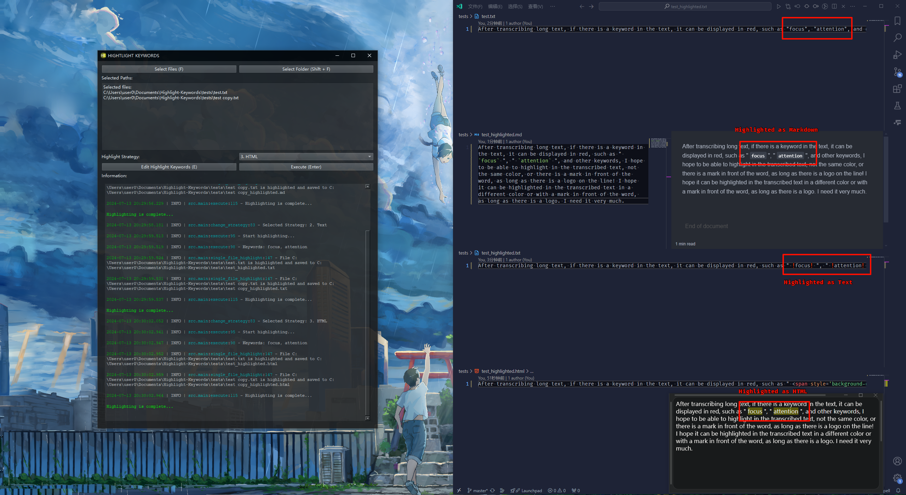
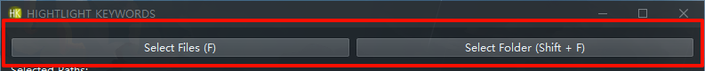
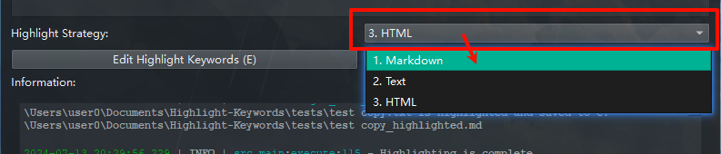

#  Highlight-Keywords



Highlight keywords in the file and generate the highlighted file.

## Features

1. Optionally add a system-level context menu (right-click on `.txt`, `.md`, `.ocr` single files to quickly open `highlight_keywords.exe`)
  > 
2. Batch select multiple files by dragging them onto ``highlight_keywords.exe``.
  > 
3. You can select multiple files or a single folder (recursive all files under the folder but excludes highlighted files)
  > 
4. Choice of three highlighting strategies (Markdown, Text, HTML).
  > 
5. Editable highlighting keyword file (each keyword takes up one line and is automatically de-weighted to remove substrings)
  > 
  > Remove substrings means that if a keyword is a substring of another keyword, only the longer keyword will be highlighted. For example, if you have three keywords: `attention`, `attention1`, `attention2`; only `attention1` and `attention2` will be highlighted, the `attention` keyword will be ignored.

---

## Usage

Download the latest version of the zip from the [Releases](https://github.com/H1DDENADM1N/Highlight-Keywords/releases) page, unzip it and run `highlight_keywords.exe`.

#### Or: 

```powershell
pip install -r requirements.txt
```

```powershell
python highlight_keywords.py
```